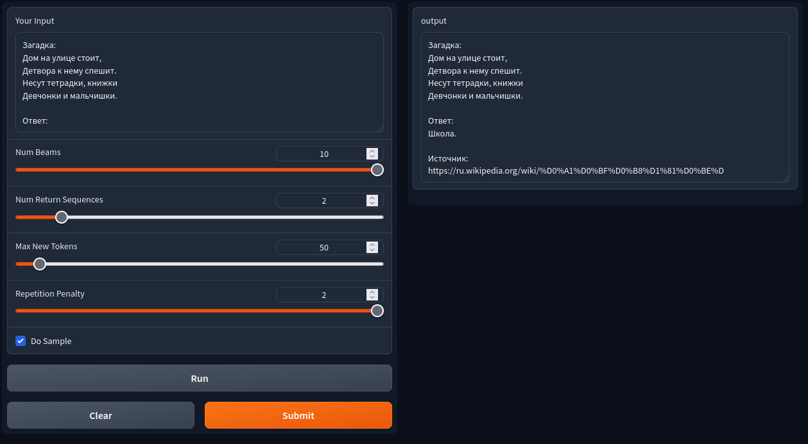
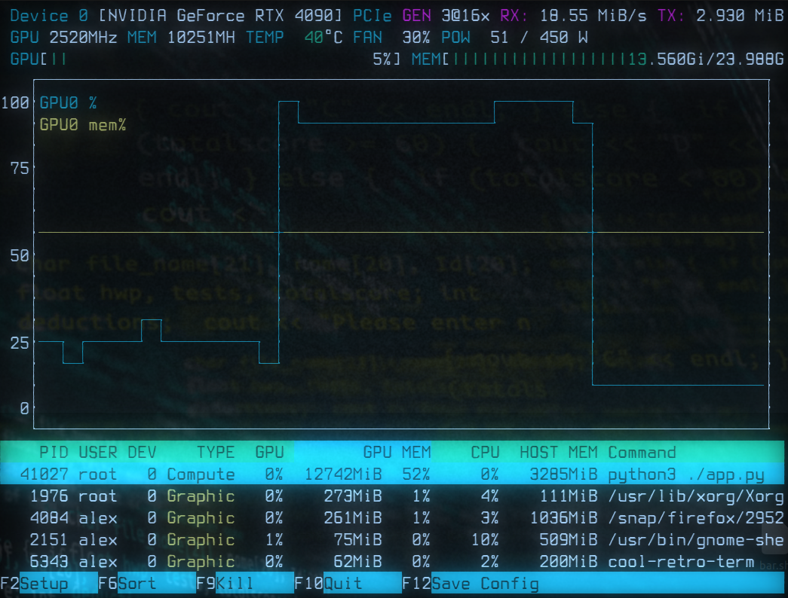

# rugpt3-docker
ruGPT-3.5-13B docker gradio client server
### Installation
```
git clone https://github.com/format37/rugpt3-docker.git
cd rugpt3-docker
sh build.sh
```
### Gradio server
```
sh run.sh
```
Go to [http://localhost:7860](http://localhost:7860)

#### Parameters
* repetition_penalty=2.0  # Set this to a value > 1 to penalize repetitions  
* Num beams=5  # Number of beams for beam search. 1 means no beam search.
* Num return sequences=1  # Number of independently computed returned sequences for each element in the batch.
* max_new_tokens=100  # Maximum number of new tokens to generate.
* Do sample=True  # Set to False to use greedy decoding instead of sampling
* Repetition penalty=2.0  # Set this to a value > 1 to penalize repetitions
### Gradio client
```
cd client
pip install -r requirements.txt
python3 client.py
```
### Performance
```
nvtop
```

### Source
[https://huggingface.co/ai-forever/ruGPT-3.5-13B](https://huggingface.co/ai-forever/ruGPT-3.5-13B)